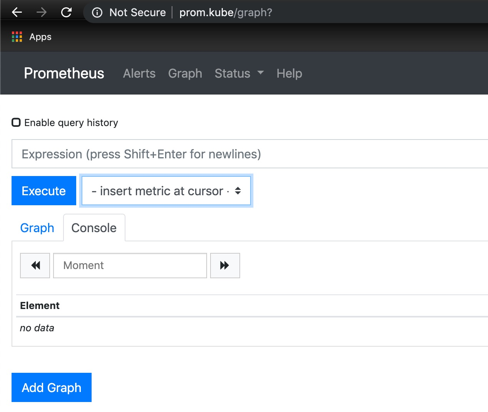
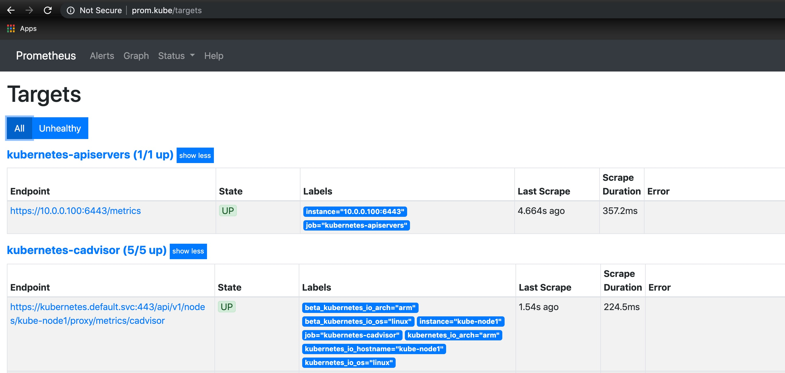

# prometheus-kube

Deploys Prometheus into a Kubernetes cluster deployed on a Raspberry Pi cluster configured with a Traefik Ingress Controller as described in [How to Install Kubernetes Ingress on a Raspberry Pi Cluster](https://medium.com/better-programming/install-kubernetes-ingress-on-a-raspberry-pi-cluster-e8d5086c5009). 

To get a fully working Prometheus deployment:

1. Clone this repository
2. `cd` into the project root directory (`prometheus-kube`) 
3. Create the namespace for Prometheus resources

    1. `kubectl create ns monitor`
2. Complete the deployment from the project root directory

    1. `helm install --namespace monitor --name prometheus helm/prometheus` 

To verify the deployment:

1. Ensure you have a `/etc/hosts` entry for `prom.kube` pointing to the IP address of the Prometheus deployment.
1. `http://prom.kube` in a browser

1. In the top navigation bar, click ***Status*** and select ***Targets*** from the dropdown (`http://prom.kube/targets`) 

All targets should show an "UP" `State`
